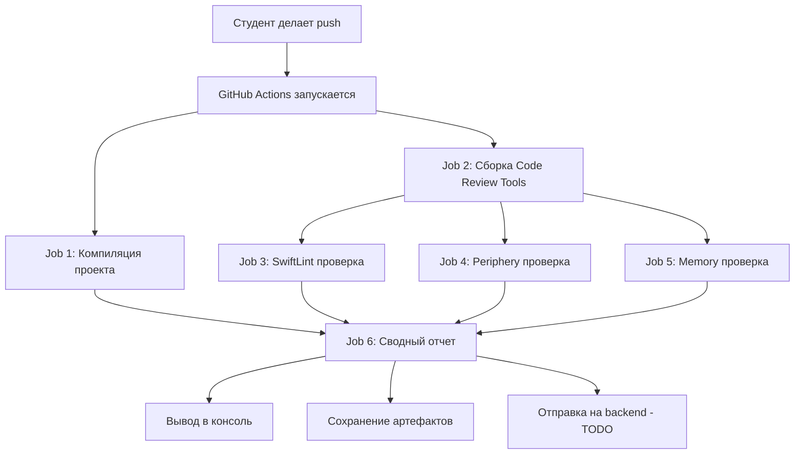

# Краткое резюме решения

## Что было создано

Полноценный **Git Template** для автоматической проверки Swift проектов студентов.

## Структура решения

```
template/
├── .github/workflows/
│   └── code-review.yml          # Главный workflow - все 4 проверки
├── scripts/
│   └── setup.sh                 # Скрипт установки инструментов локально
├── Example/                     # Пример минимального Swift проекта
│   ├── Package.swift
│   ├── Sources/
│   └── Tests/
├── .swiftlint.yml              # Конфигурация SwiftLint
├── .gitignore                  # Стандартный .gitignore для Swift
├── README.md                   # Инструкция для студентов
├── SETUP_GUIDE.md              # Инструкция для преподавателей
└── SUMMARY.md                  # Этот файл
```

## Какие проверки выполняются

### 1. 🔨 Проверка компиляции
- Определяет тип проекта (SPM / Xcode / Workspace)
- Автоматически находит схемы
- Собирает проект для iOS Simulator
- **Результат:** success/failure

### 2. 🎨 Проверка стиля кода (SwiftLint)
- Устанавливает SwiftLint через Homebrew
- Запускает проверку с JSON выводом
- Подсчитывает ошибки и предупреждения
- **Результат:** JSON отчет с issues

### 3. 🗑️ Поиск мертвого кода (Periphery)
- Устанавливает Periphery
- Сканирует Xcode проект
- Находит неиспользуемые классы, методы, свойства
- **Результат:** JSON отчет с unused code

### 4. 💾 Проверка утечек памяти
- Статический анализ retain cycles
- Проверка weak/unowned использования
- Проверка delegate свойств
- **Результат:** JSON отчет с memory issues

### 5. 📊 Сводный отчет
- Собирает все результаты в один JSON
- Выводит красивую сводку в консоль
- **Готово к отправке на backend** (пока закомментировано)

## Как это работает



## Использование студентами

### Быстрый старт (3 шага):

1. **Use this template** на GitHub
2. Клонировать и добавить свой код
3. Push → автоматические проверки!

### Результаты доступны:

- GitHub Actions logs (консоль с цветным выводом)
- Artifacts (JSON отчеты для скачивания)
- Backend API (когда настроите)

## Интеграция с backend

### Текущее состояние: ✅ Готово к интеграции

Отчет формируется в JSON формате:

```json
{
  "repository": "student/project",
  "branch": "main",
  "commit": "sha123",
  "author": "student_name",
  "timestamp": "2024-01-15T10:00:00Z",
  "build_status": "success",
  "reports": {
    "style": { "summary": { "errors": 5, "warnings": 10 }, ... },
    "dead_code": { ... },
    "memory": { ... }
  }
}
```

### Что нужно сделать:

1. Создать backend endpoint: `POST /api/code-review/results`
2. Добавить secrets в репозитории студентов:
   - `BACKEND_URL`
   - `BACKEND_TOKEN`
3. Раскомментировать код в `code-review.yml` (строка ~345)

## Преимущества решения

✅ **Полная автоматизация** - никаких ручных проверок
✅ **Убирает нагрузку с backend** - проверки идут в GitHub Actions
✅ **Масштабируемость** - работает для любого количества студентов
✅ **Прозрачность** - студенты видят все проблемы сами
✅ **Гибкость** - легко настроить правила и добавить новые проверки
✅ **Бесплатно** - GitHub Actions дает 2000 минут/месяц на публичных репо

## Ограничения и рекомендации

⚠️ **Periphery работает только для Xcode проектов** (.xcodeproj/.xcworkspace)
   - Для SPM проектов проверка пропускается

⚠️ **GitHub Actions минуты**
   - Публичные репо: безлимит
   - Приватные: 2000 мин/месяц бесплатно
   - Один прогон ~5-10 минут на macOS

⚠️ **SwiftLint может быть строгим**
   - Настройте `.swiftlint.yml` под уровень студентов
   - Начните с мягких правил, постепенно ужесточая

## Следующие шаги

### Для запуска (5 минут):

1. Создайте новый репозиторий на GitHub
2. Скопируйте содержимое `template/` туда
3. Отметьте как "Template repository" в Settings
4. Обновите ссылки на ваш репозиторий с инструментами
5. Готово! Студенты могут использовать

### Для полной интеграции (дополнительно):

6. Настройте backend endpoint
7. Добавьте secrets
8. Раскомментируйте код отправки
9. Протестируйте на тестовом репозитории
10. Дайте студентам инструкцию

## Поддержка и документация

- **README.md** - для студентов (как использовать)
- **SETUP_GUIDE.md** - для преподавателей (как развернуть)
- **Example/** - рабочий пример проекта
- **.github/workflows/code-review.yml** - все закомментировано и понятно

## Вопросы?

Все файлы содержат подробные комментарии и инструкции.
Workflow файл особенно детально задокументирован - каждый step объяснен.

Удачи в использовании! 🚀
